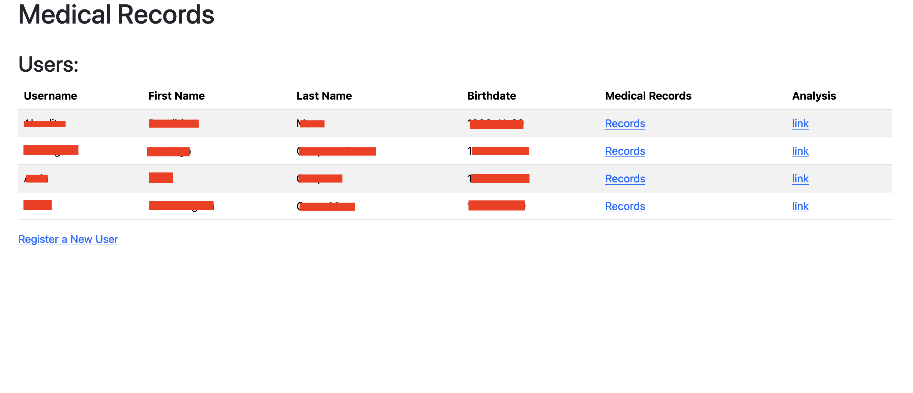
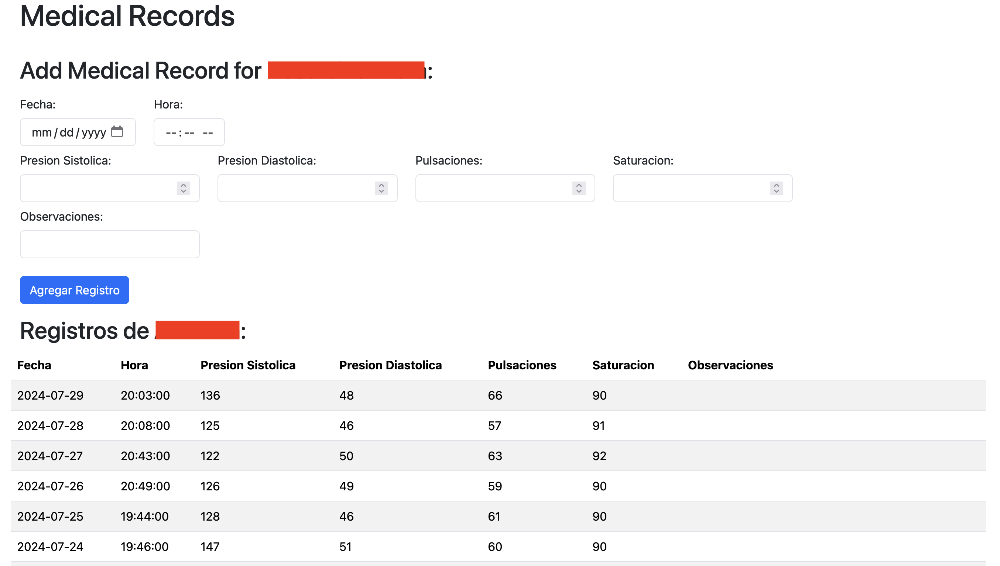

# Sistema de Monitoreo de Salud

## Descripción
Este proyecto recolecta y almacena datos de presión sanguínea, saturación y pulsaciones de pacientes en una base de datos PostgreSQL.

## Características
- Recolección de datos biométricos de pacientes.
- Almacenamiento en una base de datos PostgreSQL.

## Tecnologías Utilizadas
- Python
- PostgreSQL
- Plotly

## Instalación
1. Clona este repositorio.
   ```bash
   git clone https://github.com/usuario/presion_arterial_web.git

## Imagenes





